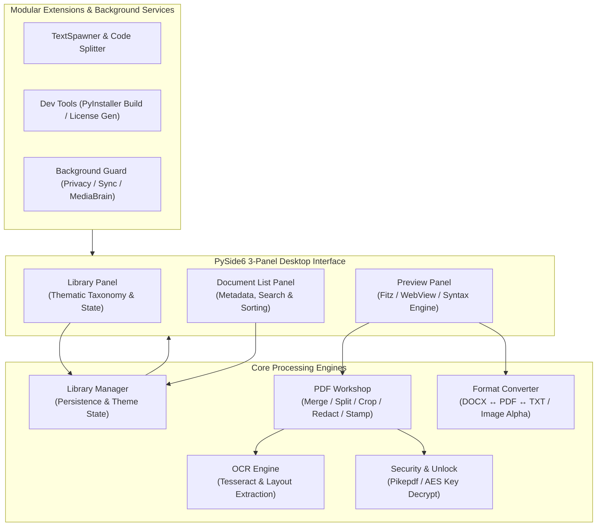

# DokuZen

[Deutsch](README_de.md) | **English**

[](https://www.python.org/)
[](https://docs.pytest.org/)
[](pyproject.toml)
[](LICENSE)
[](https://github.com/doc-bricks)
[](https://github.com/open-bricks)
[](llms.txt)

> [!NOTE]
> **AI / LLM Integration Index:** Machine-readable repository context, API boundaries, and architecture contracts are indexed in [`llms.txt`](llms.txt).

**DokuZen** is a cross-platform desktop document and file management suite built with Python and PySide6, combining **22 specialized text, PDF, and file utilities** into a single cohesive workspace.

---

## 📸 Screenshots


---

## 🏛️ System Architecture



---

## ✨ Features

### 📚 Document Library
- **Thematic Organisation**: Categorize documents by topics and tags with persistent category selection across restarts.
- **Read / Unread State**: Track review progress across large document collections.
- **Fast Search & Filtering**: Instant filter by name, content, and metadata with `Ctrl+F` global shortcut.
- **Drag & Drop Import**: Direct file ingestion into active categories.

### 📄 PDF Workshop
- **Merge & Split**: Combine multiple PDF streams or split at specific page boundaries and ranges.
- **Tesseract OCR Integration**: Generate searchable PDFs and extract textual layers with bounding-box precision.
- **Sanitization & Redaction**: Regex- and span-based PII redaction with black-fill sanitization.
- **Signature & Stamp Overlay**: Stamp transparent PNG signatures or metadata badges onto target pages.
- **Password Removal**: Decrypt password-protected files via `pikepdf` with session key guards.

### 🔄 Multi-Format Converter
- **Word ↔ PDF ↔ Markdown ↔ Plain Text**: Bidirectional document format transitions.
- **Image Conversion**: PNG, JPG, ICO, WebP with full RGBA transparency preservation on conversion to PDF.
- **Encoding Repair**: Automatic Mojibake and UTF-8/Latin-1 encoding restoration.

### 🛠️ Developer & Productivity Tools
- **Python to EXE Compiler**: PyInstaller bundling UI with icon embedding and dependency detection.
- **License Generator**: Standardized open-source license creation.
- **Code Splitter**: Clean split of multi-class Python source files into modular units.

### 🔒 Background Services & Packaging
- **Privacy Guard**: Visual privacy monitor alerting on sensitive data exposure.
- **Sync Engine**: Local-first synchronization helper.
- **Media Brain**: Integrated asset extraction and indexing.
- **Windows Store Bridge**: MSIX Packaging Manifest & automated preflight readiness checks.

---

## 🚀 Quick Start

### Requirements
- Python 3.10+
- PySide6 >= 6.5.0
- Tesseract OCR (optional, for OCR capabilities)
- Dependencies listed in `requirements.txt` / `pyproject.toml`

### Installation

```bash
# Clone the repository
git clone https://github.com/doc-bricks/DokuZen.git
cd DokuZen

# Create virtual environment
python -m venv venv
venv\Scripts\activate  # Windows
source venv/bin/activate  # Linux/macOS

# Install dependencies
pip install -r requirements.txt

# Start DokuZen
python main.py
```

*Note: On Windows, you can also launch directly via `start.bat`.*

---

## 🖥️ GUI-CLI Direct Entry Points

DokuZen provides direct CLI flags that launch the desktop application and navigate immediately into specific workflows:

```bash
# Import documents into library
python main.py --import document.pdf notes.md

# Open document in preview panel
python main.py --open manual.pdf

# Launch OCR Dialog with preloaded file
python main.py --ocr scan.pdf

# Launch Redaction Dialog
python main.py --redact contract.pdf

# Launch PDF Merger Dialog
python main.py --merge part1.pdf part2.pdf
```

> [!NOTE]
> **Automation Boundary (Readback 2026-08-11):** The evidenced use case is a local desktop document and PDF workstation. The CLI entry points above are GUI startup shortcuts. Headless batch CLI and REST API endpoints remain intentionally unasserted until explicit remote use cases and approved security models are established.

---

## 🌐 Ecosystem & Sibling Tools

DokuZen is maintained under the **`doc-bricks`** ecosystem, part of the **`open-bricks`** family of local-first tools:

| Repository | Purpose | Status |
|---|---|---|
| [doc-bricks/DokuZen](https://github.com/doc-bricks/DokuZen) | All-in-One Document & PDF Management Suite | Active / 1.0.0 |
| [doc-bricks/PDFtoPDFocr](https://github.com/doc-bricks/PDFtoPDFocr) | OCR Conversion & Searchable PDF Engine | Active / 1.1.3 |
| [doc-bricks/MediaBrain](https://github.com/doc-bricks/MediaBrain) | Multi-format Media & Metadata Extraction | Active / 0.1.0 |
| [doc-bricks/TextBrain](https://github.com/doc-bricks/TextBrain) | AI-assisted Text Analysis & Extraction | Active / 0.1.0 |
| [dev-bricks/DevCenter](https://github.com/dev-bricks/DevCenter) | Developer Productivity Hub & Dashboard | Active / 1.0.0 |
| [dev-bricks/CodeBox](https://github.com/dev-bricks/CodeBox) | Isolated Multi-Language Execution Box | Active / 0.1.2 |
| [open-bricks/.github](https://github.com/open-bricks/.github) | Umbrella Organisation & Standards | Active |

---

## 🧪 Testing & Verification

DokuZen maintains an automated test suite covering unit operations, GUI dialog smoke tests, PDF encryption lifecycles, and metadata parity:

```bash
# Run complete test suite
python -m pytest

# Run offscreen platform smoke tests
python tests/test_source_platform_smoke.py

# Run Windows Store readiness gatekeeper
python tools/check_store_readiness.py
```

---

## ⌨️ Keyboard Shortcuts

| Shortcut | Action |
|---|---|
| `Ctrl+I` | Import Files into Active Category |
| `Ctrl+N` | Create New Theme / Category |
| `Ctrl+F` | Focus Search Filter |
| `Ctrl+P` | Toggle Preview Panel |
| `Ctrl+,` | Open Preferences Dialog |
| `F5` | Refresh Document Index |

---

## 📄 License & Third-Party Dependencies

DokuZen is licensed under the **GNU Affero General Public License v3.0 or later ([AGPL-3.0-or-later](LICENSE))**.

Direct third-party libraries and runtime copyleft boundaries are documented in [`THIRD_PARTY_LICENSES.txt`](THIRD_PARTY_LICENSES.txt).
