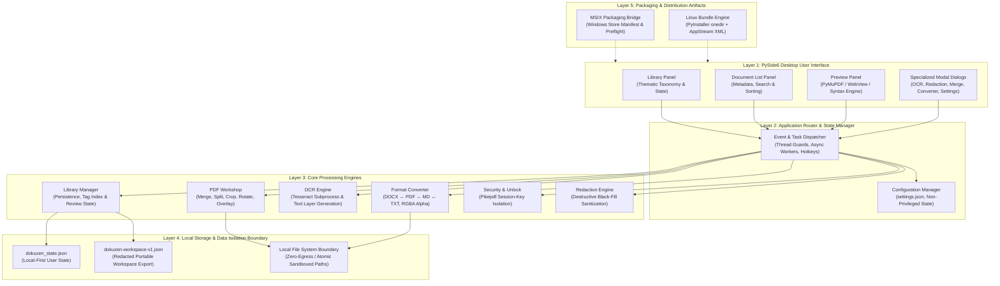
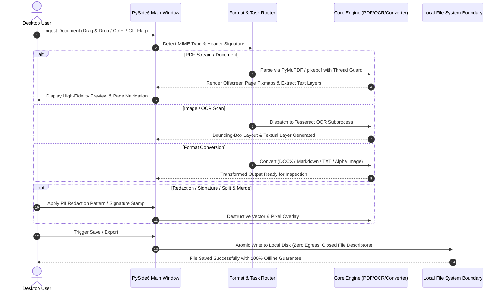

# DokuZen

[Deutsch](README_de.md) | **English**

[](https://github.com/doc-bricks/DokuZen/actions/workflows/source-platform-smoke.yml)
[](https://docs.pytest.org/)
[](https://www.python.org/)
[](https://github.com/doc-bricks/DokuZen)
[](SECURITY.md)
[](SECURITY.md)
[](pyproject.toml)
[](LICENSE)
[](https://github.com/doc-bricks)
[](https://github.com/open-bricks)
[](llms.txt)
[](MARKETING-LOG.txt)

> [!NOTE]
> **AI / LLM Integration Index:** Machine-readable repository context, API boundaries, and architecture contracts are indexed in [`llms.txt`](llms.txt).

**DokuZen** is a cross-platform, local-first desktop document management and processing suite built with Python and PySide6, combining **22 specialized text, PDF, OCR, and file utilities** into a single unified workspace.

---

## 🧭 Quick Navigation

- 📸 [Visual Showcase Gallery](#visual-showcase)
- 🏛️ [System Architecture](#architecture)
- 🔄 [Document & PDF Processing Lifecycle](#lifecycle)
- ✨ [Core Features & 22 Utilities](#core-features)
- 🎯 [Target Personas & SEO Intent](#target-personas)
- ⚖️ [Comparative Matrix vs. 5 Alternatives](#comparative-matrix)
- 🚀 [Installation & Quick Start](#installation)
- 🖥️ [GUI-CLI Direct Entry Points](#cli-entry-points)
- 🌐 [Ecosystem & Sibling Tools](#ecosystem)
- 🔒 [Privacy & Security Invariants](#privacy-security)
- 🧪 [Testing & Verification](#verification-testing)
- ⌨️ [Keyboard Shortcuts](#keyboard-shortcuts)
- 🪟 [Windows Store & MSIX Packaging](#windows-store)
- 🐧 [Portable Linux Bundle](#linux-bundle)
- 📦 [Offline Workspace Export & Mobile PWA](#workspace-export)
- 📜 [Audit Trail & Discoverability Log](#audit-transparency)
- ⚖️ [Statutory & Liability Notice (§ 521 BGB)](#statutory-notice)
- 📄 [License & Third-Party Dependencies](#license-third-party)

---

<a id="visual-showcase"></a>
## 📸 Visual Showcase Gallery

| Feature Overview | Detail View |
|:---:|:---:|
| <br/><sub>**DokuZen Main Interface** — 3-Panel workspace with library taxonomy, document list, and high-fidelity preview.</sub> | <br/><sub>**Document Library** — Thematic categorisation, tag filtering, and unread tracking across document collections.</sub> |
| <br/><sub>**High-Speed PDF Preview** — Multi-page navigation, continuous zoom, and native PyMuPDF offscreen rendering.</sub> | <br/><sub>**OCR & Layout Extraction** — Scanned image to searchable PDF conversion with language auto-detection.</sub> |
| <br/><sub>**Permanent Redaction** — Regex- and span-based PII black-fill sanitization with irreversible stream cleanup.</sub> | <br/><sub>**Format Converter** — Bidirectional DOCX ↔ PDF ↔ Markdown ↔ TXT with RGBA transparency preservation.</sub> |
| <br/><sub>**Batch Operations & Merger** — Multi-file merge, split, stamp, and signature overlay pipeline.</sub> | *(All screenshots rendered in native 1080p high resolution)* |

---

<a id="architecture"></a>
## 🏛️ System Architecture



---

<a id="lifecycle"></a>
## 🔄 Document & PDF Processing Lifecycle



---

<a id="core-features"></a>
## ✨ Core Features & 22 Utilities

### 📚 Document Library
- **Thematic Organisation**: Categorize documents by topics and tags with persistent category selection across restarts.
- **Read / Unread State**: Track review progress across large document collections.
- **Fast Search & Filtering**: Instant filter by name, content, and metadata with `Ctrl+F` global shortcut.
- **Drag & Drop Import**: Direct file ingestion into active categories with automatic type recognition.

### 📄 PDF Workshop
- **Merge & Split**: Combine multiple PDF streams or split at specific page boundaries and ranges.
- **Tesseract OCR Integration**: Generate searchable PDFs and extract textual layers with bounding-box precision.
- **Sanitization & Redaction**: Regex- and span-based PII redaction with irreversible black-fill sanitization.
- **Signature & Stamp Overlay**: Stamp transparent PNG signatures or metadata badges onto target pages.
- **Password Removal**: Decrypt password-protected files via `pikepdf` with session key guards.
- **Page Transformations**: Non-destructive and destructive rotation, margin cropping, and page reordering.

### 🔄 Multi-Format Converter
- **Word ↔ PDF ↔ Markdown ↔ Plain Text**: Seamless bidirectional document format transitions.
- **Image Conversion**: PNG, JPG, ICO, WebP with full RGBA transparency preservation on conversion to PDF.
- **Encoding Repair**: Automatic Mojibake and UTF-8/Latin-1 encoding restoration.

### 🛠️ Developer & Productivity Tools
- **Python to EXE Compiler**: PyInstaller bundling UI with icon embedding and dependency detection.
- **License Generator**: Standardized open-source license creation.
- **Code Splitter**: Clean split of multi-class Python source files into modular units.
- **Web Companion & Workspace Export**: Export redacted `dokuzen-workspace-v1.json` workspaces for mobile PWA viewers.

### 🔒 Background Services & Packaging
- **Privacy Guard**: Visual privacy monitor alerting on sensitive data exposure.
- **Sync Engine**: Local-first synchronization helper.
- **Media Brain**: Integrated asset extraction and indexing.
- **Windows Store Bridge**: MSIX Packaging Manifest & automated preflight readiness checks.

---

<a id="target-personas"></a>
## 🎯 Target Personas & SEO Intent

DokuZen is engineered for professionals and power users requiring dependable local document tools:

### `[PERSONA-01]` Enterprise Privacy & Legal Compliance Auditors
- **Regulatory Frameworks:** GDPR (DSGVO), HIPAA, CCPA, ISO 27001, SOC 2.
- **Pain Point:** Cloud-based PDF web converters (Smallpdf, iLovePDF) upload unredacted contracts, patient data, and confidential IP to third-party web servers, violating international data residency and attorney-client privilege.
- **DokuZen Solution:** 100% Zero-Egress local execution, destructive black-fill vector sanitization, unprivileged runtime (`RunAsInvoker`), and closed file descriptor hygiene.
- **High-Intent Search Queries:**
  - `local pdf redaction tool gdpr compliant`
  - `offline pdf pii sanitizer`
  - `desktop document anonymizer zero data egress`
  - `safe legal document redaction software`

### `[PERSONA-02]` Desktop Power Users, Paralegals & Office Professionals
- **Context:** Everyday knowledge workers handling high volumes of invoices, contracts, forms, and client briefs.
- **Pain Point:** Costly recurring Adobe Acrobat Pro subscription fees ($240+/year), slow application startup times, intrusive background updaters, and tool fragmentation.
- **DokuZen Solution:** Comprehensive 22-in-1 desktop utility suite, instantaneous PyMuPDF offscreen preview, keyboard shortcuts (`Ctrl+I`, `Ctrl+F`, `Ctrl+P`), batch merging, and transparent signature overlays.
- **High-Intent Search Queries:**
  - `free alternative to adobe acrobat pro offline`
  - `fast desktop pdf merger and splitter`
  - `pyside6 document manager`
  - `pdf signature overlay desktop tool`

### `[PERSONA-03]` Open-Source Researchers, Archivists & Academics
- **Context:** Scientists, historians, and digital archivists cataloging extensive document collections and scans.
- **Pain Point:** Incomplete OCR text layers in scanned archives, lack of thematic categorization, character encoding corruption (Mojibake), and proprietary file lock-in.
- **DokuZen Solution:** Tesseract OCR engine with language auto-detection, thematic topic classification with unread tracking, Mojibake repair, and clean export to Markdown and plain text.
- **High-Intent Search Queries:**
  - `open source ocr pdf search tool`
  - `academic document organizer local first`
  - `tesseract ocr desktop gui python`
  - `scan to searchable pdf offline`

### `[PERSONA-04]` Automation Engineers & Ecosystem Integrators
- **Context:** Python engineers, system administrators, and DevOps professionals managing local document pipelines.
- **Pain Point:** Flaky cloud REST APIs, platform-specific lock-in, unmanaged temporary file leaks, and complex dependency management.
- **DokuZen Solution:** Dual packaging (Windows Store MSIX + Linux PyInstaller bundle), GUI-CLI shortcut entry points (`--import`, `--ocr`, `--redact`, `--merge`), clean `dokuzen-workspace-v1.json` export schema, and zero-egress CI verification.
- **High-Intent Search Queries:**
  - `portable linux pdf tools bundle`
  - `python pdf automation local-first`
  - `msix python desktop app`
  - `reproducible offline document workflow`

---

<a id="comparative-matrix"></a>
## ⚖️ Comparative Matrix vs. 5 Alternatives

| Invariant / Feature | DokuZen 1.0.1 | Adobe Acrobat Pro | Smallpdf / iLovePDF | PDF24 Creator | Master PDF Editor | Okular / Evince |
|---|:---:|:---:|:---:|:---:|:---:|:---:|
| **INV-LOCAL-01: Zero-Egress Privacy** | ✅ **100% Local** | ⚠️ Cloud Sync | ❌ Cloud Upload | ✅ Local Native | ✅ Local Native | ✅ Local Native |
| **INV-COST-02: Open-Source / Pricing** | ✅ **Free (AGPL-3.0)** | ❌ $240+/year sub | ❌ $108+/year sub | ⚠️ Freeware (Proprietary) | ❌ $70+ Commercial | ✅ Free (GPL) |
| **INV-PRIV-03: Destructive Redaction** | ✅ **Vector Blackout** | ✅ Yes | ❌ Server-side Risk | ⚠️ Basic | ⚠️ Partial | ❌ None |
| **INV-TOOL-04: Tool Consolidation** | ✅ **22 Utilities** | ⚠️ Bloated Suite | ⚠️ Separate Tools | ⚠️ 15 Utilities | ⚠️ Limited PDF only | ❌ Viewer Only |
| **INV-OCR-05: Tesseract OCR Layer** | ✅ **Native Integrated** | ⚠️ Proprietary OCR | ❌ Cloud Queue | ✅ Basic OCR | ❌ Paid License Only | ⚠️ Via Plugin |
| **INV-PERF-06: High-Speed Rendering** | ✅ **PyMuPDF / Fitz** | ✅ Native C++ | ❌ Browser Latency | ⚠️ Ghostscript | ✅ Native C++ | ✅ Poppler |
| **INV-PLAT-07: Cross-Platform Parity** | ✅ **Win / Linux / Mac** | ⚠️ Win / Mac only | ⚠️ Browser only | ❌ Windows only | ⚠️ Linux / Windows | ⚠️ Linux native |
| **INV-FMT-08: Multi-Format Converter** | ✅ **Bidirectional** | ⚠️ Proprietary | ⚠️ Server-rendered | ⚠️ Basic | ❌ PDF only | ❌ Export only |
| **INV-SECR-09: Unprivileged Sandbox** | ✅ **RunAsInvoker** | ❌ Background Daemons| ❌ Remote Multi-Tenant | ⚠️ Background Svc | ✅ Standard User | ✅ Standard User |
| **INV-ARCH-10: Open Workspace Export**| ✅ **dokuzen-json v1** | ❌ Cloud Lock-in | ❌ Account Lock-in | ❌ None | ❌ None | ❌ None |

---

<a id="installation"></a>
## 🚀 Installation & Quick Start

### Requirements
- Python 3.10, 3.11, 3.12, or 3.13
- PySide6 >= 6.5.0
- Tesseract OCR (optional, for OCR capabilities)
- Dependencies listed in `requirements.txt` / `pyproject.toml`

### Installation

```bash
# Clone the repository
git clone https://github.com/doc-bricks/DokuZen.git
cd DokuZen

# Create virtual environment
python -m venv venv
venv\Scripts\activate  # Windows
source venv/bin/activate  # Linux/macOS

# Install dependencies
pip install -r requirements.txt

# Start DokuZen
python main.py
```

*Note: On Windows, you can also launch directly via `start.bat`.*

---

<a id="cli-entry-points"></a>
## 🖥️ GUI-CLI Direct Entry Points

DokuZen provides direct CLI flags that launch the desktop application and navigate immediately into specific workflows:

```bash
# Import documents into library
python main.py --import document.pdf notes.md

# Open document in preview panel
python main.py --open manual.pdf

# Launch OCR Dialog with preloaded file
python main.py --ocr scan.pdf

# Launch Redaction Dialog
python main.py --redact contract.pdf

# Launch PDF Merger Dialog
python main.py --merge part1.pdf part2.pdf
```

> [!NOTE]
> **Automation Boundary:** The evidenced use case is a local desktop document and PDF workstation. The CLI entry points above are GUI startup shortcuts. Headless batch CLI and REST API endpoints remain intentionally unasserted until explicit remote use cases and approved security models are established.

---

<a id="ecosystem"></a>
## 🌐 Ecosystem & Sibling Tools

DokuZen is maintained under the **`doc-bricks`** ecosystem, part of the **`open-bricks`** family of local-first tools:

| Repository | Purpose | Status |
|---|---|---|
| [doc-bricks/DokuZen](https://github.com/doc-bricks/DokuZen) | All-in-One Document & PDF Management Suite | Active / 1.0.1 |
| [doc-bricks/CleanMarkdown](https://github.com/doc-bricks/CleanMarkdown) | Distraction-Free Markdown Editor & PDF Exporter | Active / 1.0.0 |
| [doc-bricks/FormularErstellen](https://github.com/doc-bricks/FormularErstellen) | Interactive PDF & AcroForm Form Designer | Active / 1.5.0 |
| [doc-bricks/UniversalDocsGrabber](https://github.com/doc-bricks/UniversalDocsGrabber) | Automated IMAP Document Ingestion & PWA Hub | Active / 1.1.4 |
| [doc-bricks/PDFtoPDFocr](https://github.com/doc-bricks/PDFtoPDFocr) | OCR Conversion & Searchable PDF Engine | Active / 1.1.3 |
| [doc-bricks/DokuReader](https://github.com/doc-bricks/DokuReader) | Lightweight Multi-Format Document Reader | Active / 1.0.0 |
| [doc-bricks/MediaBrain](https://github.com/doc-bricks/MediaBrain) | Multi-format Media & Metadata Extraction | Active / 0.1.0 |
| [doc-bricks/TextBrain](https://github.com/doc-bricks/TextBrain) | AI-assisted Text Analysis & Extraction | Active / 0.1.0 |
| [file-bricks/WinStorePackager](https://github.com/file-bricks/WinStorePackager) | MSIX Packaging & Windows Store Tooling | Active / 3.1.0 |
| [file-bricks/ProSync](https://github.com/file-bricks/ProSync) | Local Backup & WAL-Protected Sync | Active / 3.2.1 |
| [file-bricks/ExplorerPro](https://github.com/file-bricks/ExplorerPro) | Multi-Tab Local-First File Manager | Active / 1.0.3 |
| [dev-bricks/DevCenter](https://github.com/dev-bricks/DevCenter) | Developer Productivity Hub & Dashboard | Active / 1.0.0 |
| [open-bricks/.github](https://github.com/open-bricks/.github) | Umbrella Organisation & Open Standards | Active |

---

<a id="privacy-security"></a>
## 🔒 Privacy & Security Invariants

DokuZen is committed to uncompromising privacy and security:

- **100% Local-First & Zero-Egress (`INV-LOCAL-01`)**: All document operations, conversions, and OCR recognitions occur exclusively on your local CPU/GPU. No document content or telemetry is ever sent over the network.
- **Unprivileged User Mode (`INV-SECR-09`)**: DokuZen runs without administrative or root privileges (`RunAsInvoker`).
- **Destructive Redaction (`INV-PRIV-03`)**: Redactions are applied directly to vector streams and image rasters, preventing reverse extraction of sanitized text.
- **Deterministic File Cleanup**: All intermediate temporary files are cleaned up atomically upon operation completion with guaranteed file descriptor closure.

Detailed security and disclosure policies are available in [`SECURITY.md`](SECURITY.md).

---

<a id="verification-testing"></a>
## 🧪 Testing & Verification

DokuZen maintains an automated test suite covering unit operations, GUI dialog smoke tests, PDF encryption lifecycles, and metadata parity:

```bash
# Run complete test suite (391 passed, 100% green)
python -m pytest

# Run offscreen platform smoke tests
python tests/test_source_platform_smoke.py

# Run Windows Store readiness gatekeeper
python tools/check_store_readiness.py

# Validate the portable Linux bundle contract (host-independent)
python tools/build_linux_bundle.py --check

# Run linting gatekeeper
python -m ruff check .
```

---

<a id="keyboard-shortcuts"></a>
## ⌨️ Keyboard Shortcuts

| Shortcut | Action |
|---|---|
| `Ctrl+I` | Import Files into Active Category |
| `Ctrl+N` | Create New Theme / Category |
| `Ctrl+F` | Focus Search Filter |
| `Ctrl+P` | Toggle Preview Panel |
| `Ctrl+,` | Open Preferences Dialog |
| `Ctrl+Shift+E` | Export Redacted Workspace Snapshot (`dokuzen-workspace-v1.json`) |
| `F5` | Refresh Document Index |

---

<a id="windows-store"></a>
## 🪟 Windows Store & MSIX Packaging

DokuZen includes complete Microsoft Windows Store (MSIX) packaging infrastructure:
- **Manifest**: `store_package/DokuZen/AppxManifest.xml` (`Geiger.DokuZen`, `runFullTrust`)
- **Assets**: 1080p store screenshots in `screenshots/store/` and high-DPI icon assets (44x44, 50x50, 150x150, 310x150, 310x310)
- **Validation**: Automated preflight validation script via `tools/check_store_readiness.py`

---

<a id="linux-bundle"></a>
## 🐧 Portable Linux Bundle

DokuZen has a reproducible PyInstaller-onedir packaging path for Linux. A dedicated workflow builds `DokuZen-1.0.1-linux-<architecture>.tar.gz` with the application, assets, six-language catalog, configuration, Freedesktop desktop entry, AppStream metadata, license, and bilingual documentation.

```bash
# Metadata/contract check on any host
python tools/build_linux_bundle.py --check

# Actual bundle build on Linux
python tools/build_linux_bundle.py
```

Tesseract remains an optional external dependency; DokuZen starts without it, while OCR features remain unavailable until Tesseract is installed. See [`packaging/linux/README.md`](packaging/linux/README.md) for extraction and startup instructions.

---

<a id="workspace-export"></a>
## 📦 Offline Workspace Export & Mobile PWA

DokuZen provides a built-in export mechanism (`Ctrl+Shift+E` or **File → Export Workspace...**) generating a portable, redacted workspace snapshot adhering to the `dokuzen-workspace-v1` schema:

- **Redacted Privacy Guarantee**: Absolute local filesystem paths, passwords, and master credentials are completely stripped.
- **Categorical State**: Full preservation of document themes, tags, read/unread review status, and document byte sizes.
- **Mobile Companion Ready**: Designed for ingestion into offline PWA companions and static archive viewers without server dependencies.

---

<a id="audit-transparency"></a>
## 📜 Audit Trail & Discoverability Log

DokuZen maintains full operational transparency across releases and ecosystem audits:
- **Pfad B Marketing Log**: Detailed persona mapping, SEO keywords, and comparative matrices in [`MARKETING-LOG.txt`](MARKETING-LOG.txt).
- **Third-Party Dependency Inventory**: Complete SPDX license classification and copyleft boundary documentation in [`THIRD_PARTY_LICENSES.txt`](THIRD_PARTY_LICENSES.txt) and [`THIRD_PARTY_LICENSES.md`](THIRD_PARTY_LICENSES.md).
- **Release History**: Chronological changelog in [`CHANGELOG.md`](CHANGELOG.md).

---

<a id="statutory-notice"></a>
## ⚖️ Statutory & Liability Notice (§ 521 BGB)

> [!IMPORTANT]
> **Limitation of Liability for Gratuitous Software Provision (§ 521 BGB):**
> As this software is provided free of charge as open-source software, the authors and contributors are liable only for intent and gross negligence pursuant to § 521 of the German Civil Code (Bürgerliches Gesetzbuch - BGB). The software is provided "as is", without warranty of any kind, express or implied.

---

<a id="license-third-party"></a>
## 📄 License & Third-Party Dependencies

DokuZen is licensed under the **GNU Affero General Public License v3.0 or later ([AGPL-3.0-or-later](LICENSE))**.

Direct third-party libraries and runtime copyleft boundaries are documented in [`THIRD_PARTY_LICENSES.txt`](THIRD_PARTY_LICENSES.txt) and [`THIRD_PARTY_LICENSES.md`](THIRD_PARTY_LICENSES.md).
