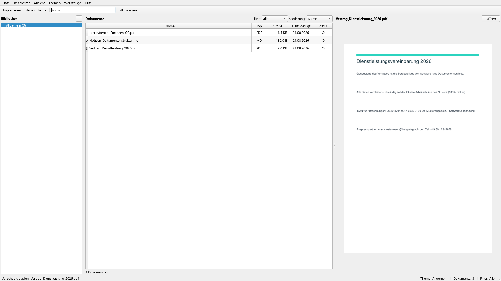
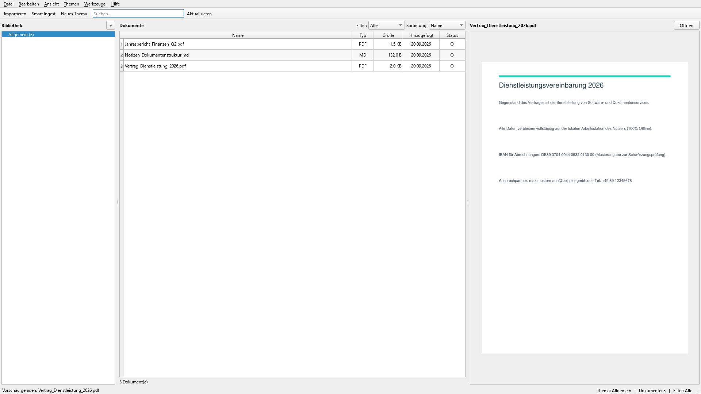
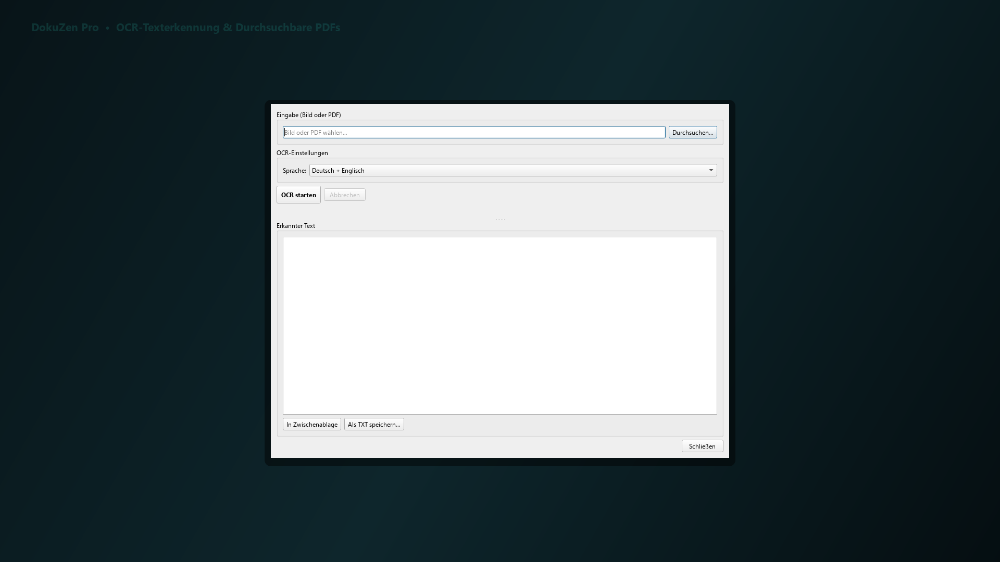
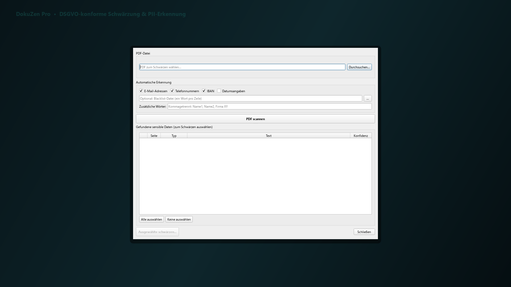
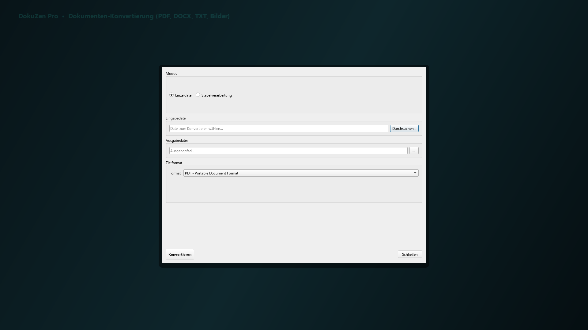
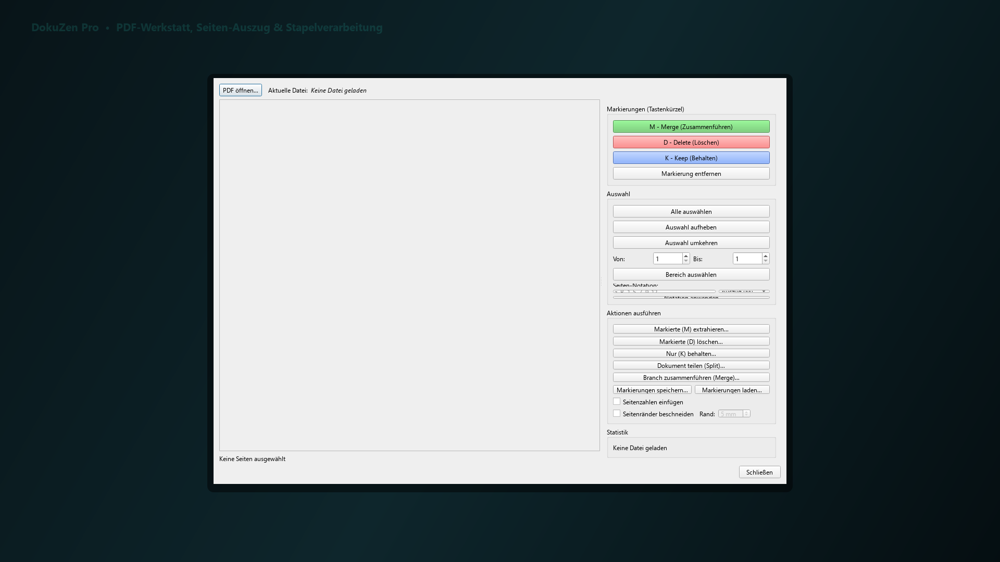
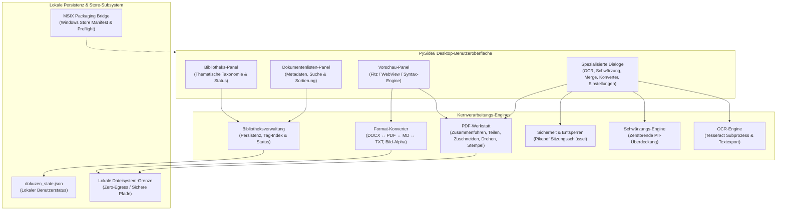
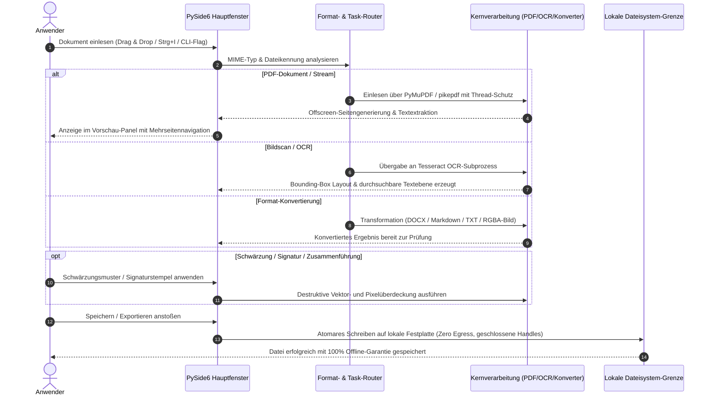

# DokuZen

**Deutsch** | [English](README.md)

[](https://github.com/doc-bricks/DokuZen/actions/workflows/source-platform-smoke.yml)
[](https://docs.pytest.org/)
[](https://www.python.org/)
[](https://github.com/doc-bricks/DokuZen)
[](SECURITY.md)
[](SECURITY.md)
[](pyproject.toml)
[](LICENSE)
[](https://github.com/doc-bricks)
[](https://github.com/open-bricks)
[](llms.txt)

> [!NOTE]
> **KI / LLM Integrations-Index:** Maschinenlesbarer Repository-Kontext, Schnittstellengrenzen und Architekturverträge sind in [`llms.txt`](llms.txt) hinterlegt.

**DokuZen** ist eine plattformübergreifende, lokale Dokumenten- und Dateiverwaltungssuite in Python und PySide6, die **22 spezialisierte Text-, PDF-, OCR- und Dateiwerkzeuge** in einer einzigen integrierten Arbeitsumgebung vereint.

---

## 🧭 Schnellnavigation

- 📸 [Visuelle Showcase-Galerie](#-visuelle-showcase-galerie)
- 🏛️ [Systemarchitektur](#️-systemarchitektur)
- 🔄 [Dokumenten- & PDF-Verarbeitungszyklus](#-dokumenten--pdf-verarbeitungszyklus)
- ✨ [Funktionen & Werkzeuge](#-funktionen--werkzeuge)
- 🚀 [Installation & Schnellstart](#-installation--schnellstart)
- 🖥️ [GUI-CLI Startoptionen](#️-gui-cli-startoptionen)
- 🌐 [Ökosystem & Geschwisterwerkzeuge](#-ökosystem--geschwisterwerkzeuge)
- 🔒 [Datenschutz & Sicherheitsinvarianten](#-datenschutz--sicherheitsinvarianten)
- 🧪 [Tests & Qualitätssicherung](#-tests--qualitätssicherung)
- ⌨️ [Tastenkürzel](#️-tastenkürzel)
- 🪟 [Windows Store & Paketierung](#-windows-store--paketierung)
- 📄 [Lizenz & Drittanbieter-Lizenzen](#-lizenz--drittanbieter-lizenzen)

---

## 📸 Visuelle Showcase-Galerie

| Funktionsübersicht | Detailansicht |
|:---:|:---:|
| <br/><sub>**DokuZen Hauptansicht** — 3-Panel-Arbeitsbereich mit Bibliothekstaxonomie, Dokumentliste und hochauflösender Vorschau.</sub> | <br/><sub>**Dokumentenbibliothek** — Themenorganisation, Schlagwortfilterung und Lesestatus-Verwaltung.</sub> |
| <br/><sub>**Hochgeschwindigkeits-PDF-Vorschau** — Mehrseitennavigation, stufenloser Zoom und natives PyMuPDF-Rendering.</sub> | <br/><sub>**OCR & Layoutextraktion** — Konvertierung von Bildscans in durchsuchbare PDFs mit Spracherkennung.</sub> |
| <br/><sub>**Permanente Schwärzung** — Regex- und bereichsbasierte PII-Anonymisierung mit sicherer Überdeckung.</sub> | <br/><sub>**Format-Konverter** — Bidirektional DOCX ↔ PDF ↔ Markdown ↔ TXT mit RGBA-Transparenzerhaltung.</sub> |
| <br/><sub>**Batch-Verarbeitung & Merger** — Mehrdatei-Zusammenführung, Aufteilung, Stempel und Signatur-Overlay.</sub> | *(Alle Screenshots in nativer 1080p High-Resolution-Qualität)* |

---

## 🏛️ Systemarchitektur



---

## 🔄 Dokumenten- & PDF-Verarbeitungszyklus



---

## ✨ Funktionen & Werkzeuge

### 📚 Dokumentenbibliothek
- **Themenbasierte Organisation:** Kategorisierung nach Themen und Schlagwörtern; gewählte Kategorie bleibt auch nach Umbenennen oder Neustarts stabil.
- **Gelesen / Ungelesen-Status:** Übersichtlicher Lesefortschritt bei umfangreichen Dokumentensammlungen.
- **Schnelle Suche & Filter:** Filterung nach Namen, Tags und Inhalten per `Ctrl+F` Schnellzugriff.
- **Drag & Drop Import:** Direkter Dateiimport in aktive Kategorien mit automatischer Typunterstützung.

### 📄 PDF-Werkstatt
- **Zusammenführen & Teilen:** PDF-Dokumente flexibel zusammenfügen oder an Seitenbereichen aufteilen.
- **Tesseract OCR-Integration:** Automatische Erzeugung durchsuchbarer PDFs und präzise Textextraktion.
- **Schwärzung & Anonymisierung:** Regex- und bereichsbasierte Schwärzung sensibler PII-Daten mit irreversibler Überdeckung.
- **Signatur- & Stempel-Overlay:** Platzierung transparenter PNG-Signaturen oder Prüfstempel auf Zielseiten.
- **Passwortentfernung:** Entsperren passwortgeschützter PDF-Dateien via `pikepdf`.

### 🔄 Format-Konvertierung
- **Word ↔ PDF ↔ Markdown ↔ Text:** Nahtlose bidirektionale Konvertierung gängiger Dokumentformate.
- **Bildkonvertierung:** PNG, JPG, ICO, WebP mit vollständiger RGBA-Transparenzerhaltung beim Export nach PDF.
- **Encoding-Reparatur:** Automatische Erkennung und Behebung von Mojibake- und UTF-8/Latin-1-Fehlern.

### 🛠️ Entwickler- & Produktivitäts-Tools
- **Python zu EXE Compiler:** PyInstaller GUI-Integration mit Icon-Einbindung und Abhängigkeitserkennung.
- **Lizenz-Generator:** Standardisierte Erstellung gängiger Open-Source-Lizenzen.
- **Code-Splitter:** Saubere Aufteilung mehrteiliger Python-Quelldateien in modulare Strukturen.

### 🔒 Hintergrunddienste & Store-Integration
- **Privacy Guard:** Optische Datenschutz-Ampel zur Erkennung exponierter sensibler Daten.
- **Sync Engine:** Lokale Synchronisationsunterstützung.
- **Media Brain:** Integrierte Medien- und Metadaten-Extraktion.
- **Windows Store Bridge:** MSIX Packaging Manifest & automatisierter Readiness Preflight Gatekeeper.

---

## 🚀 Installation & Schnellstart

### Voraussetzungen
- Python 3.10+
- PySide6 >= 6.5.0
- Tesseract OCR (optional, für Texterkennung)
- Abhängigkeiten gemäß `requirements.txt` / `pyproject.toml`

### Installation

```bash
# Repository klonen
git clone https://github.com/doc-bricks/DokuZen.git
cd DokuZen

# Virtuelle Umgebung erstellen
python -m venv venv
venv\Scripts\activate  # Windows
source venv/bin/activate  # Linux/macOS

# Abhängigkeiten installieren
pip install -r requirements.txt

# DokuZen starten
python main.py
```

*Hinweis: Unter Windows kann die Anwendung auch direkt über `start.bat` gestartet werden.*

---

## 🖥️ GUI-CLI Startoptionen

DokuZen bietet CLI-Flags für den direkten Start in spezifische Workflows:

```bash
# Dokumente direkt in die Bibliothek importieren
python main.py --import beispiel.pdf notiz.md

# Dokument im Vorschau-Panel öffnen
python main.py --open handbuch.pdf

# OCR-Dialog mit vorgeladener Datei öffnen
python main.py --ocr scan.pdf

# Schwärzungs-Dialog öffnen
python main.py --redact vertrag.pdf

# PDF-Zusammenführungs-Dialog öffnen
python main.py --merge teil1.pdf teil2.pdf
```

> [!NOTE]
> **Automationsgrenze:** Der belegte Anwendungsfall ist eine lokale Desktop-Dokumenten- und PDF-Werkstatt. Die obigen Optionen sind GUI-Startaktionen. Headless-Batch-CLI und REST-API sind im aktuellen Stand ausdrücklich Nicht-Bestandteile.

---

## 🌐 Ökosystem & Geschwisterwerkzeuge

DokuZen wird innerhalb der **`doc-bricks`** Suite unter dem gemeinsamen Dach von **`open-bricks`** gepflegt:

| Repository | Zweck | Status |
|---|---|---|
| [doc-bricks/DokuZen](https://github.com/doc-bricks/DokuZen) | All-in-One Dokumenten- & PDF-Verwaltungssuite | Aktiv / 1.0.0 |
| [doc-bricks/CleanMarkdown](https://github.com/doc-bricks/CleanMarkdown) | Ablenkungsfreier Markdown-Editor & PDF-Exporter | Aktiv / 1.0.0 |
| [doc-bricks/FormularErstellen](https://github.com/doc-bricks/FormularErstellen) | Interaktiver PDF- & AcroForm-Formulardesigner | Aktiv / 1.5.0 |
| [doc-bricks/UniversalDocsGrabber](https://github.com/doc-bricks/UniversalDocsGrabber) | Automatisierter IMAP-Dokumentenabruf & PWA-Hub | Aktiv / 1.1.4 |
| [doc-bricks/PDFtoPDFocr](https://github.com/doc-bricks/PDFtoPDFocr) | OCR-Konvertierung & Searchable-PDF Engine | Aktiv / 1.1.3 |
| [doc-bricks/DokuReader](https://github.com/doc-bricks/DokuReader) | Schlanker Multi-Format Dokumenten- & E-Book-Reader | Aktiv / 1.0.0 |
| [doc-bricks/MediaBrain](https://github.com/doc-bricks/MediaBrain) | Multi-Format Medien- & Metadaten-Extraktion | Aktiv / 0.1.0 |
| [doc-bricks/TextBrain](https://github.com/doc-bricks/TextBrain) | KI-gestützte Text- & Markdown-Verarbeitung | Aktiv / 0.1.0 |
| [file-bricks/WinStorePackager](https://github.com/file-bricks/WinStorePackager) | MSIX Packaging & Windows Store Tooling | Aktiv / 3.1.0 |
| [file-bricks/ProSync](https://github.com/file-bricks/ProSync) | Lokales Backup & WAL-geschützter Sync | Aktiv / 3.2.1 |
| [file-bricks/ExplorerPro](https://github.com/file-bricks/ExplorerPro) | Multi-Tab Local-First Dateimanager | Aktiv / 1.0.3 |
| [dev-bricks/DevCenter](https://github.com/dev-bricks/DevCenter) | Entwickler-Dashboard & Workflow-Zentrum | Aktiv / 1.0.0 |
| [open-bricks/.github](https://github.com/open-bricks/.github) | Dachorganisation & Standard-Richtlinien | Aktiv |

---

## 🔒 Datenschutz & Sicherheitsinvarianten

DokuZen garantiert kompromisslose Privatsphäre und Systemsicherheit:

- **100% Local-First & Zero-Egress**: Sämtliche Dokumentoperationen, Konvertierungen und OCR-Verarbeitungen erfolgen ausschließlich lokal auf Ihrem System. Es werden keinerlei Dokumentinhalte oder Telemetriedaten übertragen.
- **Benutzermodus (Non-Elevation)**: DokuZen läuft vollständig ohne Administrator- oder Root-Rechte.
- **Destruktive Schwärzung**: Schwärzungen werden dauerhaft im Dokumenten- und Pixelstrom verankert, sodass eine nachträgliche Rekonstruktion unmöglich ist.
- **Deterministische Bereinigung**: Alle temporären Zwischendateien werden nach Abschluss der Operation atomar gelöscht.

Detaillierte Sicherheits- und Offenlegungsrichtlinien finden sich in [`SECURITY.md`](SECURITY.md).

---

## 🧪 Tests & Qualitätssicherung

DokuZen verfügt über eine automatisierte Testsuite für Unit-Operationen, Dialog-Smoke-Tests, PDF-Verschlüsselungszyklen und Metadaten-Parität:

```bash
# Vollständige Pytest-Suite ausführen
python -m pytest

# Offscreen Plattform-Smoke-Test
python tests/test_source_platform_smoke.py

# Windows Store Readiness Gatekeeper
python tools/check_store_readiness.py

# Linting-Gatekeeper
python -m ruff check .
```

---

## ⌨️ Tastenkürzel

| Tastenkürzel | Funktion |
|---|---|
| `Ctrl+I` | Dateien importieren |
| `Ctrl+N` | Neues Thema anlegen |
| `Ctrl+F` | Suchfeld fokussieren |
| `Ctrl+P` | Vorschau ein-/ausblenden |
| `Ctrl+,` | Einstellungen öffnen |
| `F5` | Dokumentenliste aktualisieren |

---

## 🪟 Windows Store & Paketierung

DokuZen verfügt über vollständige Microsoft Windows Store (MSIX) Paketierungsinfrastruktur:
- **Manifest**: `store_package/DokuZen/AppxManifest.xml` (`Geiger.DokuZen`, `runFullTrust`)
- **Grafiken**: 1080p Store-Screenshots in `screenshots/store/` und High-DPI Kachelicons (44x44, 50x50, 150x150, 310x150, 310x310)
- **Validierung**: Automatisierter Preflight-Prüflauf via `tools/check_store_readiness.py`

---

## 📄 Lizenz & Drittanbieter-Lizenzen

DokuZen ist unter der **GNU Affero General Public License v3.0 or later ([AGPL-3.0-or-later](LICENSE))** lizenziert.

Direkte Laufzeitabhängigkeiten und Copyleft-Grenzbestimmungen sind in [`THIRD_PARTY_LICENSES.txt`](THIRD_PARTY_LICENSES.txt) dokumentiert.

