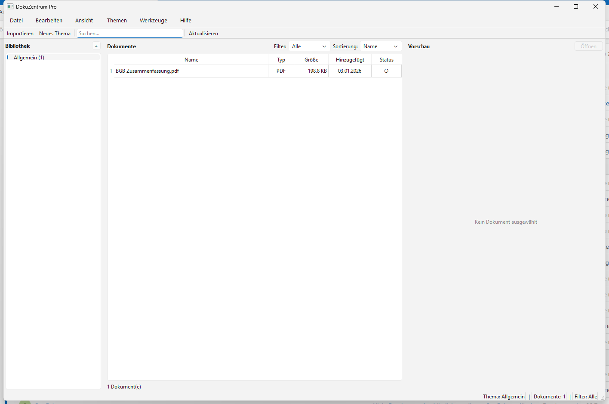
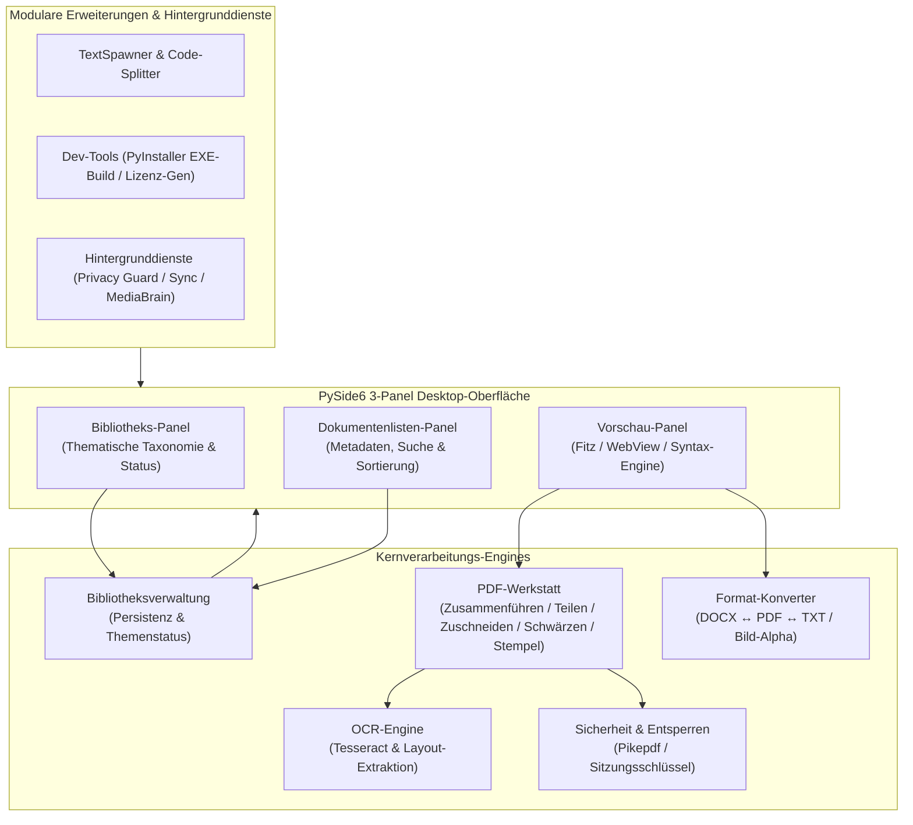

# DokuZen

**Deutsch** | [English](README.md)

[](https://www.python.org/)
[](https://docs.pytest.org/)
[](pyproject.toml)
[](LICENSE)
[](https://github.com/doc-bricks)
[](https://github.com/open-bricks)
[](llms.txt)

> [!NOTE]
> **KI / LLM Integrations-Index:** Maschinenlesbarer Repository-Kontext, Schnittstellengrenzen und Architekturverträge sind in [`llms.txt`](llms.txt) hinterlegt.

**DokuZen** ist eine plattformübergreifende Dokumenten- und Dateiverwaltungssuite in Python und PySide6, die **22 spezialisierte Text-, PDF- und Dateiwerkzeuge** in einer einzigen Arbeitsumgebung vereint.

---

## 📸 Screenshots



---

## 🏛️ Systemarchitektur



---

## ✨ Funktionen & Werkzeuge

### 📚 Dokumentenbibliothek
- **Themenbasierte Organisation:** Kategorisierung nach Themen und Schlagwörtern; gewählte Kategorie bleibt auch nach Umbenennen oder Neustarts stabil.
- **Gelesen / Ungelesen-Status:** Übersichtlicher Lesefortschritt bei umfangreichen Dokumentensammlungen.
- **Schnelle Suche & Filter:** Filterung nach Namen, Tags und Inhalten per `Ctrl+F` Schnellzugriff.
- **Drag & Drop Import:** Direkter Dateiimport in aktive Kategorien.

### 📄 PDF-Werkstatt
- **Zusammenführen & Teilen:** PDF-Dokumente flexibel zusammenfügen oder an Seitenbereichen aufteilen.
- **Tesseract OCR-Integration:** Automatische Erzeugung durchsuchbarer PDFs und präzise Textextraktion.
- **Schwärzung & Anonymisierung:** Regex- und bereichsbasierte Schwärzung sensibler PII-Daten mit sicherer Überdeckung.
- **Signatur- & Stempel-Overlay:** Platzierung transparenter PNG-Signaturen oder Prüfstempel auf Zielseiten.
- **Passwortentfernung:** Entsperren passwortgeschützter PDF-Dateien via `pikepdf`.

### 🔄 Format-Konvertierung
- **Word ↔ PDF ↔ Markdown ↔ Text:** Bidirektionale Konvertierung gängiger Dokumentformate.
- **Bildkonvertierung:** PNG, JPG, ICO, WebP mit vollständiger RGBA-Transparenzerhaltung beim Export nach PDF.
- **Encoding-Reparatur:** Automatische Erkennung und Behebung von Mojibake- und UTF-8/Latin-1-Fehlern.

### 🛠️ Entwickler- & Produktivitäts-Tools
- **Python zu EXE Compiler:** PyInstaller GUI-Integration mit Icon-Einbindung und Abhängigkeitserkennung.
- **Lizenz-Generator:** Standardisierte Erstellung gängiger Open-Source-Lizenzen.
- **Code-Splitter:** Saubere Aufteilung mehrteiliger Python-Quelldateien in modulare Strukturen.

### 🔒 Hintergrunddienste & Store-Integration
- **Privacy Guard:** Optische Datenschutz-Ampel zur Erkennung exponierter sensibler Daten.
- **Sync Engine:** Lokale Synchronisationsunterstützung.
- **Media Brain:** Integrierte Medien- und Metadaten-Extraktion.
- **Windows Store Bridge:** MSIX Packaging Manifest & automatisierter Readiness Preflight Gatekeeper.

---

## 🚀 Installation & Schnellstart

### Voraussetzungen
- Python 3.10+
- PySide6 >= 6.5.0
- Tesseract OCR (optional, für Texterkennung)
- Abhängigkeiten gemäß `requirements.txt` / `pyproject.toml`

### Installation

```bash
# Repository klonen
git clone https://github.com/doc-bricks/DokuZen.git
cd DokuZen

# Virtuelle Umgebung erstellen
python -m venv venv
venv\Scripts\activate  # Windows
source venv/bin/activate  # Linux/macOS

# Abhängigkeiten installieren
pip install -r requirements.txt

# DokuZen starten
python main.py
```

*Hinweis: Unter Windows kann die Anwendung auch direkt über `start.bat` gestartet werden.*

---

## 🖥️ GUI-CLI Startoptionen

DokuZen bietet CLI-Flags für den direkten Start in spezifische Workflows:

```bash
# Dokumente direkt in die Bibliothek importieren
python main.py --import beispiel.pdf notiz.md

# Dokument im Vorschau-Panel öffnen
python main.py --open handbuch.pdf

# OCR-Dialog mit vorgeladener Datei öffnen
python main.py --ocr scan.pdf

# Schwärzungs-Dialog öffnen
python main.py --redact vertrag.pdf

# PDF-Zusammenführungs-Dialog öffnen
python main.py --merge teil1.pdf teil2.pdf
```

> [!NOTE]
> **Automationsgrenze (Readback 2026-08-11):** Der belegte Anwendungsfall ist eine lokale Desktop-Dokumenten- und PDF-Werkstatt. Die obigen Optionen sind GUI-Startaktionen. Headless-Batch-CLI und REST-API sind im aktuellen Stand ausdrücklich Nicht-Bestandteile.

---

## 🌐 Ökosystem & Geschwisterwerkzeuge

DokuZen wird innerhalb der **`doc-bricks`** Suite unter dem gemeinsamen Dach von **`open-bricks`** gepflegt:

| Repository | Zweck | Status |
|---|---|---|
| [doc-bricks/DokuZen](https://github.com/doc-bricks/DokuZen) | All-in-One Dokumenten- & PDF-Verwaltungssuite | Aktiv / 1.0.0 |
| [doc-bricks/PDFtoPDFocr](https://github.com/doc-bricks/PDFtoPDFocr) | OCR-Konvertierung & Searchable-PDF Engine | Aktiv / 1.1.3 |
| [doc-bricks/MediaBrain](https://github.com/doc-bricks/MediaBrain) | Multi-Format Medien- & Metadaten-Extraktion | Aktiv / 0.1.0 |
| [doc-bricks/TextBrain](https://github.com/doc-bricks/TextBrain) | KI-gestützte Text- & Markdown-Verarbeitung | Aktiv / 0.1.0 |
| [dev-bricks/DevCenter](https://github.com/dev-bricks/DevCenter) | Entwickler-Dashboard & Workflow-Zentrum | Aktiv / 1.0.0 |
| [dev-bricks/CodeBox](https://github.com/dev-bricks/CodeBox) | Isolierte Multi-Language Code-Ausführung | Aktiv / 0.1.2 |
| [open-bricks/.github](https://github.com/open-bricks/.github) | Dachorganisation & Standard-Richtlinien | Aktiv |

---

## 🧪 Tests & Qualitätssicherung

DokuZen verfügt über eine automatisierte Testsuite für Unit-Operationen, Dialog-Smoke-Tests, PDF-Verschlüsselungszyklen und Metadaten-Parität:

```bash
# Vollständige Pytest-Suite ausführen
python -m pytest

# Offscreen Plattform-Smoke-Test
python tests/test_source_platform_smoke.py

# Windows Store Readiness Gatekeeper
python tools/check_store_readiness.py
```

---

## ⌨️ Tastenkürzel

| Tastenkürzel | Funktion |
|---|---|
| `Ctrl+I` | Dateien importieren |
| `Ctrl+N` | Neues Thema anlegen |
| `Ctrl+F` | Suchfeld fokussieren |
| `Ctrl+P` | Vorschau ein-/ausblenden |
| `Ctrl+,` | Einstellungen öffnen |
| `F5` | Dokumentenliste aktualisieren |

---

## 📄 Lizenz & Drittanbieter-Lizenzen

DokuZen ist unter der **GNU Affero General Public License v3.0 or later ([AGPL-3.0-or-later](LICENSE))** lizenziert.

Direkte Laufzeitabhängigkeiten und Copyleft-Grenzbestimmungen sind in [`THIRD_PARTY_LICENSES.txt`](THIRD_PARTY_LICENSES.txt) dokumentiert.
