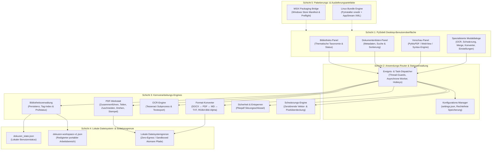
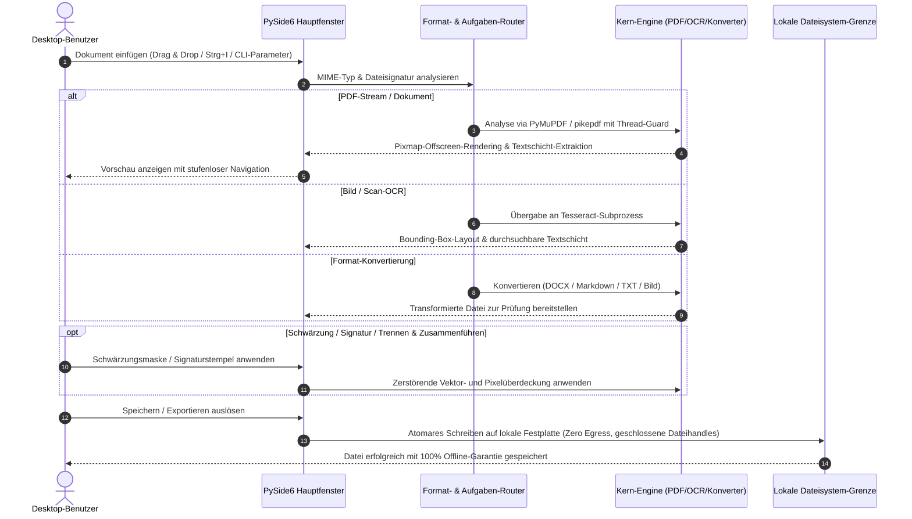

# DokuZen

**Deutsch** | [English](README.md)

[](https://github.com/doc-bricks/DokuZen/actions/workflows/source-platform-smoke.yml)
[](https://docs.pytest.org/)
[](https://www.python.org/)
[](https://github.com/doc-bricks/DokuZen)
[](SECURITY.md)
[](SECURITY.md)
[](pyproject.toml)
[](LICENSE)
[](NOTICE)
[](https://github.com/doc-bricks)
[](https://github.com/open-bricks)
[](llms.txt)
[](MARKETING-LOG.txt)

> [!NOTE]
> **KI / LLM Integrations-Index:** Maschinenlesbarer Repository-Kontext, Schnittstellengrenzen und Architekturverträge sind in [`llms.txt`](llms.txt) hinterlegt.

**DokuZen** ist eine plattformübergreifende, lokale Dokumenten- und Dateiverwaltungssuite in Python und PySide6, die **22 spezialisierte Text-, PDF-, OCR- und Dateiwerkzeuge** in einer einzigen integrierten Arbeitsumgebung vereint.

---

## 🧭 Schnellnavigation

- 📸 [Visuelle Showcase-Galerie](#visual-showcase)
- 🏛️ [Systemarchitektur](#architecture)
- 🔄 [Dokumenten- & PDF-Verarbeitungszyklus](#lifecycle)
- ✨ [Funktionen & 22 Werkzeuge](#core-features)
- 🎯 [Zielgruppen & SEO-Suchintentionen](#target-personas)
- ⚖️ [Vergleichsmatrix vs. 5 Alternativen](#comparative-matrix)
- 🚀 [Installation & Schnellstart](#installation)
- 🖥️ [GUI-CLI Startoptionen](#cli-entry-points)
- 🌐 [Ökosystem & Geschwisterwerkzeuge](#ecosystem)
- 🔒 [Datenschutz & Sicherheitsinvarianten](#privacy-security)
- 🧪 [Tests & Qualitätssicherung](#verification-testing)
- ⌨️ [Tastenkürzel](#keyboard-shortcuts)
- 🪟 [Windows Store & MSIX-Paketierung](#windows-store)
- 🐧 [Portables Linux-Bundle](#linux-bundle)
- 📦 [Offline Arbeitsbereich-Export & Mobile PWA](#workspace-export)
- 📜 [Audit-Trail & Marketing-Log](#audit-transparency)
- ⚖️ [Rechtliche Hinweise & Haftungsausschluss (§ 521 BGB)](#statutory-notice)
- 📄 [Lizenz & Drittanbieter-Lizenzen](#license-third-party)

---

<a id="visual-showcase"></a>
## 📸 Visuelle Showcase-Galerie

| Funktionsübersicht | Detailansicht |
|:---:|:---:|
| <br/><sub>**DokuZen Hauptansicht** — 3-Panel-Arbeitsbereich mit Bibliothekstaxonomie, Dokumentliste und hochauflösender Vorschau.</sub> | <br/><sub>**Dokumentenbibliothek** — Themenorganisation, Schlagwortfilterung und Lesestatus-Verwaltung.</sub> |
| <br/><sub>**Hochgeschwindigkeits-PDF-Vorschau** — Mehrseitennavigation, stufenloser Zoom und natives PyMuPDF-Rendering.</sub> | <br/><sub>**OCR & Layoutextraktion** — Konvertierung von Bildscans in durchsuchbare PDFs mit Spracherkennung.</sub> |
| <br/><sub>**Permanente Schwärzung** — Regex- und bereichsbasierte PII-Anonymisierung mit sicherer Überdeckung.</sub> | <br/><sub>**Format-Konverter** — Bidirektional DOCX ↔ PDF ↔ Markdown ↔ TXT mit RGBA-Transparenzerhaltung.</sub> |
| <br/><sub>**Batch-Verarbeitung & Merger** — Mehrdatei-Zusammenführung, Aufteilung, Stempel und Signatur-Overlay.</sub> | *(Alle Screenshots in nativer 1080p High-Resolution-Qualität)* |

---

<a id="architecture"></a>
## 🏛️ Systemarchitektur



---

<a id="lifecycle"></a>
## 🔄 Dokumenten- & PDF-Verarbeitungszyklus



---

<a id="core-features"></a>
## ✨ Funktionen & 22 Werkzeuge

### 📚 Dokumentenbibliothek
- **Thematische Organisation**: Dokumente nach Themen und Schlagwörtern kategorisieren mit persistenter Themenauswahl über Neustarts hinweg.
- **Gelesen / Ungelesen Status**: Schnelle Nachverfolgung des Prüfstatus in umfangreichen Dokumentensammlungen.
- **Schnellsuche & Filterung**: Sofortige Filterung nach Dateiname, Volltext und Metadaten über `Strg+F`.
- **Drag & Drop Import**: Direktes Ablegen von Dateien in aktive Themenkategorien mit automatischer Formaterkennung.

### 📄 PDF-Werkstatt
- **Zusammenführen & Teilen**: Beliebig viele PDFs zusammenfügen oder an flexiblen Seitengrenzen auftrennen.
- **Tesseract OCR Integration**: Scans und Rasterbilder in durchsuchbare PDFs mit präzisen Textkoordinaten umwandeln.
- **Datenschutz & Schwärzung**: Regex- und bereichsbasierte Schwärzung mit zerstörender Vektorüberdeckung sensibler Daten.
- **Signatur- & Stempel-Overlay**: Transparente PNG-Unterschriften und Prüfstempel auf Zielseiten einprägen.
- **Kennwortentfernung**: Entschlüsselung kennwortgeschützter PDFs über `pikepdf` mit Sitzungsschlüssel-Isolierung.
- **Seitentransformationen**: Verlustfreies Drehen, Randbeschnitt und Neuanordnung von Dokumentseiten.

### 🔄 Format-Konverter
- **Word ↔ PDF ↔ Markdown ↔ Reiner Text**: Nahtlose bidirektionale Dokumenttransformationen.
- **Bildkonvertierung**: PNG, JPG, ICO, WebP mit vollständiger RGBA-Transparenzerhaltung bei PDF-Erzeugung.
- **Zeichenkodierungs-Reparatur**: Automatische Beseitigung von Mojibake und UTF-8/Latin-1 Fehlern.

### 🛠️ Produktivitäts- & Entwicklerwerkzeuge
- **Python-zu-EXE Compiler**: PyInstaller-Paketierungsoberfläche mit Symbol-Einbettung und Abhängigkeitsanalyse.
- **Lizenz-Generator**: Erstellung standardisierter Open-Source-Lizenzdokumente.
- **Code-Splitter**: Saubere Modularisierung mehrklassiger Python-Dateien.
- **Web-Begleiter & Arbeitsbereich-Export**: Erstellung bereinigter `dokuzen-workspace-v1.json`-Dateien für mobile PWA-Begleiter.

### 🔒 Hintergrunddienste & Store-Integration
- **Privacy Guard**: Visuelle Datenschutzüberwachung zur Erkennung exponierter Daten.
- **Sync Engine**: Lokaler Synchronisationshelfer ohne Fremdserver.
- **Media Brain**: Integrierte Medien- und Metadaten-Extraktion.
- **Windows Store Bridge**: MSIX Packaging Manifest & automatisierte Qualitätsprüfung via Preflight-Skript.

---

<a id="target-personas"></a>
## 🎯 Zielgruppen & SEO-Suchintentionen

DokuZen richtet sich an professionelle Anwender mit strikten Anforderungen an Datenschutz, Zuverlässigkeit und lokale Datenverarbeitung:

### `[PERSONA-01]` Datenschutzbeauftragte, Compliance-Prüfer & Juristen (DSGVO, HIPAA, CCPA, ISO 27001)
- **Kontext:** Rechtsanwälte, Notariate, Wirtschaftsprüfer und Compliance-Teams mit strenger Geheimhaltungspflicht.
- **Herausforderung:** Webbasierte Cloud-PDF-Dienste (Smallpdf, iLovePDF) übertragen vertrauliche Dokumente, Mandantenakten und Patientendaten unverschlüsselt auf Drittserver und verletzen das Berufsgeheimnis sowie Art. 44 ff. DSGVO.
- **DokuZen-Lösung:** 100% Zero-Egress lokale Datenverarbeitung, unwiderrufliche Vektorschwärzung ohne Textrestbestände, rechtefreie Ausführung (`RunAsInvoker`) und saubere Deskriptorhygiene.
- **Relevante SEO-Suchbegriffe:**
  - `lokales pdf schwärzen dsgvo konform`
  - `offline pdf pii datenschutz schwärzungstool`
  - `desktop dokumenten anonymisierung zero egress`
  - `rechtssichere pdf schwärzung software`

### `[PERSONA-02]` Power-User, Rechtsanwaltsfachangestellte & Büroanwender
- **Kontext:** Wissensarbeiter mit täglichem Eingang hunderter Verträge, Rechnungen und Schriftsätze.
- **Herausforderung:** Hohe wiederkehrende Lizenzkosten für Adobe Acrobat Pro (über 240 €/Jahr), langsame Programmstarts, störende Hintergrundprozesse und unübersichtliche Einzellösungen.
- **DokuZen-Lösung:** Ganzheitliche 22-in-1 Suite, blitzschnelle PyMuPDF-Vorschau, Tastatur-Shortcuts (`Strg+I`, `Strg+F`, `Strg+P`), Stapelverarbeitung und Signaturstempel.
- **Relevante SEO-Suchbegriffe:**
  - `kostenlose adobe acrobat pro alternative offline`
  - `schneller desktop pdf merger und splitter`
  - `pyside6 dokumentenverwaltung open source`
  - `pdf signatur stempel desktop werkzeug`

### `[PERSONA-03]` Wissenschaftler, Archivare & Rechercheure
- **Kontext:** Historiker, Bibliothekare und Open-Science-Forscher mit umfangreichen Sammlungen von Scans und Fachartikeln.
- **Herausforderung:** Fehlende Durchsuchbarkeit in gescannten Altbeständen, unzureichende thematische Katalogisierung, Mojibake-Zeichensatzfehler und Abhängigkeit von proprietären Formaten.
- **DokuZen-Lösung:** Integrierte Tesseract OCR mit automatischer Spracherkennung, persistente Themenkategorien mit Lesestatus, Zeichensatzreparatur und verlustfreier Export in Markdown/TXT.
- **Relevante SEO-Suchbegriffe:**
  - `open source ocr pdf such tool`
  - `akademische dokumentenverwaltung local first`
  - `tesseract ocr desktop gui python`
  - `scans in durchsuchbare pdf umwandeln offline`

### `[PERSONA-04]` Automatisierungs-Ingenieure & Systemintegratoren
- **Kontext:** DevOps-Ingenieure, Systemadministratoren und Python-Entwickler mit lokalen Dokumenten-Pipelines.
- **Herausforderung:** Unzuverlässige Cloud-APIs, herstellerspezifische Abhängigkeiten, Lecks bei temporären Dateihandles und komplexe Bereitstellung.
- **DokuZen-Lösung:** Zweigleisige Paketierung (Windows Store MSIX + Linux PyInstaller Bundle), GUI-CLI Startparameter (`--import`, `--ocr`, `--redact`, `--merge`), standardisiertes `dokuzen-workspace-v1.json` Schema und automatisierte CI-Validierung.
- **Relevante SEO-Suchbegriffe:**
  - `portables linux pdf bundle`
  - `python pdf automatisierung local first`
  - `msix python desktop app`
  - `reproduzierbarer offline dokumenten workflow`

---

<a id="comparative-matrix"></a>
## ⚖️ Vergleichsmatrix vs. 5 Alternativen

| Invariante / Merkmal | DokuZen 1.0.1 | Adobe Acrobat Pro | Smallpdf / iLovePDF | PDF24 Creator | Master PDF Editor | Okular / Evince |
|---|:---:|:---:|:---:|:---:|:---:|:---:|
| **INV-LOCAL-01: Zero-Egress Datenschutz** | ✅ **100% Lokal** | ⚠️ Cloud-Sync | ❌ Cloud-Upload | ✅ Lokal Nativ | ✅ Lokal Nativ | ✅ Lokal Nativ |
| **INV-COST-02: Kostenmodell & Lizenz** | ✅ **Kostenfrei (AGPLv3)** | ❌ 240+ €/Jahr Abo | ❌ 108+ €/Jahr Abo | ⚠️ Freeware (Proprietär) | ❌ 70+ € Einmalkauf | ✅ Kostenfrei (GPL) |
| **INV-PRIV-03: Zerstörende Schwärzung** | ✅ **Vektor-Blackout** | ✅ Ja | ❌ Server-Risiko | ⚠️ Basis | ⚠️ Eingeschränkt | ❌ Keine |
| **INV-TOOL-04: Werkzeug-Bündelung** | ✅ **22 Werkzeuge** | ⚠️ Überladene Suite | ⚠️ Getrennte Tools | ⚠️ 15 Werkzeuge | ⚠️ Nur PDF-Editor | ❌ Nur Anzeigeprogramm |
| **INV-OCR-05: Tesseract OCR-Schicht** | ✅ **Nativ integriert** | ⚠️ Proprietäre OCR | ❌ Cloud-Queue | ✅ Basis-OCR | ❌ Nur in Kaufversion | ⚠️ Nur via Plugin |
| **INV-PERF-06: Schnelle Render-Engine** | ✅ **PyMuPDF / Fitz** | ✅ Natives C++ | ❌ Browser-Latenz | ⚠️ Ghostscript | ✅ Natives C++ | ✅ Poppler |
| **INV-PLAT-07: Plattform-Parität** | ✅ **Win / Linux / Mac** | ⚠️ Nur Win / Mac | ⚠️ Nur Browser | ❌ Nur Windows | ⚠️ Linux / Windows | ⚠️ Nativ für Linux |
| **INV-FMT-08: Format-Konverter** | ✅ **Bidirektional** | ⚠️ Proprietär | ⚠️ Server-Rendering | ⚠️ Basis | ❌ Nur PDF | ❌ Nur Export |
| **INV-SECR-09: Unprivilegierte Ausführung**| ✅ **RunAsInvoker** | ❌ Hintergrunddienste| ❌ Fremdserver | ⚠️ Hintergrunddienst | ✅ Standardbenutzer | ✅ Standardbenutzer |
| **INV-ARCH-10: Portabler Export** | ✅ **dokuzen-json v1** | ❌ Cloud-Lock-in | ❌ Account-Zwang | ❌ Keine | ❌ Keine | ❌ Keine |

---

<a id="installation"></a>
## 🚀 Installation & Schnellstart

### Systemvoraussetzungen
- Python 3.10, 3.11, 3.12 oder 3.13
- PySide6 >= 6.5.0
- Tesseract OCR (optional, für OCR-Texterkennung)
- Abhängigkeiten gem. `requirements.txt` / `pyproject.toml`

### Installation

```bash
# Repository klonen
git clone https://github.com/doc-bricks/DokuZen.git
cd DokuZen

# Virtuelle Umgebung anlegen
python -m venv venv
venv\Scripts\activate  # Windows
source venv/bin/activate  # Linux/macOS

# Abhängigkeiten installieren
pip install -r requirements.txt

# DokuZen starten
python main.py
```

*Hinweis: Unter Windows kann der Start auch direkt per Doppelklick auf `start.bat` erfolgen.*

---

<a id="cli-entry-points"></a>
## 🖥️ GUI-CLI Startoptionen

DokuZen unterstützt direkte Kommandozeilen-Parameter zur sofortigen Öffnung bestimmter Arbeitsabläufe in der grafischen Benutzeroberfläche:

```bash
# Dokumente direkt in die Bibliothek importieren
python main.py --import dokument.pdf notizen.md

# Dokument sofort in der Vorschau öffnen
python main.py --open handbuch.pdf

# OCR-Dialog mit vorausgewählter Datei öffnen
python main.py --ocr scan.pdf

# Schwärzungsdialog starten
python main.py --redact vertrag.pdf

# PDF-Zusammenführungsdialog aufrufen
python main.py --merge teil1.pdf teil2.pdf
```

> [!NOTE]
> **Automationsgrenze:** DokuZen ist als vollwertige Desktop-Arbeitsumgebung für Menschen konzipiert. Die CLI-Parameter dienen dem schnellen GUI-Start. Headless-Batch-Schnittstellen und REST-APIs werden bewusst nicht vorgehalten, um die strengen Zero-Egress-Sicherheitsmodelle zu wahren.

---

<a id="ecosystem"></a>
## 🌐 Ökosystem & Geschwisterwerkzeuge

DokuZen ist Teil des **`doc-bricks`** Ökosystems unter dem gemeinsamen Dach von **`open-bricks`**:

| Repository | Zweck | Status |
|---|---|---|
| [doc-bricks/DokuZen](https://github.com/doc-bricks/DokuZen) | All-in-One Dokumenten- und PDF-Verwaltungssuite | Aktiv / 1.0.1 |
| [doc-bricks/CleanMarkdown](https://github.com/doc-bricks/CleanMarkdown) | Ablenkungsfreier Markdown-Editor & PDF-Berichtsgenerator | Aktiv / 1.0.0 |
| [doc-bricks/FormularErstellen](https://github.com/doc-bricks/FormularErstellen) | Interaktiver Designer für PDF- und AcroForm-Formulare | Aktiv / 1.5.0 |
| [doc-bricks/UniversalDocsGrabber](https://github.com/doc-bricks/UniversalDocsGrabber) | Automatisierter IMAP-Dokumenteneingang & PWA-Hub | Aktiv / 1.1.4 |
| [doc-bricks/PDFtoPDFocr](https://github.com/doc-bricks/PDFtoPDFocr) | OCR-Konvertierung & Erzeugung durchsuchbarer PDFs | Aktiv / 1.1.3 |
| [doc-bricks/DokuReader](https://github.com/doc-bricks/DokuReader) | Schlanker Multi-Format Dokumenten-Betrachter | Aktiv / 1.0.0 |
| [doc-bricks/MediaBrain](https://github.com/doc-bricks/MediaBrain) | Multi-Format Medien- und Metadaten-Extraktion | Aktiv / 0.1.0 |
| [doc-bricks/TextBrain](https://github.com/doc-bricks/TextBrain) | KI-unterstützte Textanalyse und Inhaltsprüfung | Aktiv / 0.1.0 |
| [file-bricks/WinStorePackager](https://github.com/file-bricks/WinStorePackager) | MSIX-Paketierungswerkzeuge für den Windows Store | Aktiv / 3.1.0 |
| [file-bricks/ProSync](https://github.com/file-bricks/ProSync) | Lokale Datensicherung mit WAL-Schutz | Aktiv / 3.2.1 |
| [file-bricks/ExplorerPro](https://github.com/file-bricks/ExplorerPro) | Dateimanager mit Registerkarten und Split-View | Aktiv / 1.0.3 |
| [dev-bricks/DevCenter](https://github.com/dev-bricks/DevCenter) | Entwickler-Dashboard und Projektkoordination | Aktiv / 1.0.0 |
| [open-bricks/.github](https://github.com/open-bricks/.github) | Dachorganisation & offene Qualitätsstandards | Aktiv |

---

<a id="privacy-security"></a>
## 🔒 Datenschutz & Sicherheitsinvarianten

DokuZen unterliegt kompromisslosen Sicherheits- und Privatsphäre-Standards:

- **100% Local-First & Zero-Egress (`INV-LOCAL-01`)**: Sämtliche Dokumentenoperationen, Konvertierungen und OCR-Verarbeitungen erfolgen lokal auf Ihrer CPU/GPU. Es werden keinerlei Daten oder Telemetriedaten übertragen.
- **Rechtefreie Ausführung (`INV-SECR-09`)**: DokuZen benötigt und beansprucht keine administrativen Rechte (`RunAsInvoker`).
- **Zerstörende Schwärzung (`INV-PRIV-03`)**: Schwärzungen erfolgen direkt im PDF-Vektorstrom und Pixelraster, wodurch eine Rekonstruktion geschwärzter Inhalte ausgeschlossen ist.
- **Saubere Dateihandle-Hygiene**: Alle temporären Zwischendateien werden nach Abschluss der Operation atomar gelöscht und Dateideskriptoren deterministisch geschlossen.

Details entnehmen Sie der Sicherheitsrichtlinie in [`SECURITY.md`](SECURITY.md).

---

<a id="verification-testing"></a>
## 🧪 Tests & Qualitätssicherung

DokuZen verfügt über eine umfangreiche Testsuite mit Unit-Tests, GUI-Rauchtests, Verschlüsselungsprüfungen und Metadatenparität:

```bash
# Gesamte Testsuite ausführen (391 Tests, 100% bestanden)
python -m pytest

# Offscreen-Plattform Rauchtests durchführen
python tests/test_source_platform_smoke.py

# Windows Store Bereitschaftsprüfung starten
python tools/check_store_readiness.py

# Portablen Linux-Bundle-Vertrag prüfen (plattformunabhängig)
python tools/build_linux_bundle.py --check

# Linter-Prüfung ausführen
python -m ruff check .
```

---

<a id="keyboard-shortcuts"></a>
## ⌨️ Tastenkürzel

| Tastenkürzel | Aktion |
|---|---|
| `Strg+I` | Dateien in aktive Kategorie importieren |
| `Strg+N` | Neues Thema / Kategorie erstellen |
| `Strg+F` | Suchfeld fokussieren |
| `Strg+P` | Vorschau-Panel ein-/ausblenden |
| `Strg+,` | Einstellungen öffnen |
| `Strg+Umschalt+E` | Redigierten Arbeitsbereich exportieren (`dokuzen-workspace-v1.json`) |
| `F5` | Dokumentenliste aktualisieren |

---

<a id="windows-store"></a>
## 🪟 Windows Store & MSIX-Paketierung

DokuZen beinhaltet die vollständige Microsoft Windows Store Paketierungs-Infrastruktur:
- **Manifest**: `store_package/DokuZen/AppxManifest.xml` (`Geiger.DokuZen`, `runFullTrust`)
- **Grafiken**: 1080p Store-Screenshots in `screenshots/store/` und hochauflösende App-Symbole (44x44, 50x50, 150x150, 310x150, 310x310)
- **Validierung**: Automatisierte Qualitätsprüfung über `tools/check_store_readiness.py`

Die Packaging-Provenienz ist ausdrücklich getrennt: Das aktive `1.0.1.0`-
Store-Paket verwendet bewusst den etablierten Executable-Namen
`DokuZen-Pro-1.0.0-win64.exe`. Das Manifest unter `store_package/DokuZen Pro/`
ist historisch und kein aktiver Paketeingang; der Readiness-Gatekeeper prüft
direkt `store_package/DokuZen/AppxManifest.xml`.

---

<a id="linux-bundle"></a>
## 🐧 Portables Linux-Bundle

DokuZen bietet einen reproduzierbaren PyInstaller-onedir Paketierungspfad für Linux. Ein dedizierter Workflow erstellt `DokuZen-1.0.1-linux-<architektur>.tar.gz` inklusive Anwendung, Assets, sechssprachigem Katalog, Konfiguration, Desktop-Entry und AppStream-Metadaten.

```bash
# Metadaten- und Vertragsprüfung auf jedem Host
python tools/build_linux_bundle.py --check

# Bundle-Erstellung auf Linux
python tools/build_linux_bundle.py
```

Tesseract bleibt eine optionale externe Abhängigkeit; DokuZen startet auch ohne Tesseract, wobei OCR-Funktionen erst nach Installation bereitstehen. Siehe [`packaging/linux/README.md`](packaging/linux/README.md).

---

<a id="workspace-export"></a>
## 📦 Offline Arbeitsbereich-Export & Mobile PWA

DokuZen enthält eine integrierte Exportfunktion (`Strg+Umschalt+E` oder **Datei → Arbeitsbereich exportieren...**), die einen portablen, redigierten Arbeitsbereich nach dem `dokuzen-workspace-v1` Schema erzeugt:

- **Datenschutz-Garantie**: Absolute lokale Dateipfade, Passwörter und Anmeldedaten werden vollständig entfernt.
- **Thematischer Status**: Vollständige Erhaltung der Kategorien, Schlagwörter, Lesestatus und Dateigrößen.
- **Mobile Begleiter**: Optimiert für die direkte Anzeige in mobilen Offline-PWA-Begleitern ohne Cloud-Abhängigkeiten.

---

<a id="audit-transparency"></a>
## 📜 Audit-Trail & Marketing-Log

DokuZen dokumentiert alle operativen und qualitativen Meilensteine:
- **Pfad B Marketing-Log**: Detaillierte Persona-Profile, SEO-Suchbegriffe und Vergleichsmatrizen in [`MARKETING-LOG.txt`](MARKETING-LOG.txt).
- **Drittanbieter-Lizenzen**: Vollständige SPDX-Lizenzklassifizierung und Copyleft-Grenzen in [`THIRD_PARTY_LICENSES.txt`](THIRD_PARTY_LICENSES.txt) und [`THIRD_PARTY_LICENSES.md`](THIRD_PARTY_LICENSES.md).
- **Versionshistorie**: Chronologisches Änderungsprotokoll in [`CHANGELOG.md`](CHANGELOG.md).

---

<a id="statutory-notice"></a>
## ⚖️ Rechtliche Hinweise & Haftungsausschluss (§ 521 BGB)

> [!IMPORTANT]
> **Haftungsbeschränkung bei unentgeltlicher Bereitstellung gem. § 521 BGB:**
> Da diese Software unentgeltlich und Open-Source zur Verfügung gestellt wird, haften die Urheber und Mitwirkenden gemäß § 521 BGB nur für Vorsatz und grobe Fahrlässigkeit. Die Software wird in der vorliegenden Form („as is“) ohne Gewährleistung für Funktionalität, Vollständigkeit oder Eignung für einen bestimmten Zweck bereitgestellt.

---

<a id="license-third-party"></a>
## 📄 Lizenz & Drittanbieter-Lizenzen

DokuZen ist lizenziert unter der **GNU Affero General Public License v3.0 or later ([AGPL-3.0-or-later](LICENSE))**. Urheberrechtshinweise und Open-Source-Provenienz sind in [`NOTICE`](NOTICE) deklariert.

Direkte Drittanbieter-Bibliotheken und Laufzeit-Copyleft-Grenzen sind in [`THIRD_PARTY_LICENSES.txt`](THIRD_PARTY_LICENSES.txt) und [`THIRD_PARTY_LICENSES.md`](THIRD_PARTY_LICENSES.md) dokumentiert.
